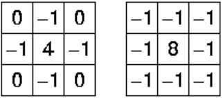

# Edge-detection
# OpenCV program Edge detection in real time 
**laplacien** :
Le laplacien est quelque peu différent des méthodes que nous avons discutées jusqu'à présent. 

Contrairement aux détecteurs de bord Sobel et Prewitt, le détecteur de bord laplacien n’utilise qu’un seul noyau. Il calcule les dérivées de second ordre en un seul passage. Deux petits noyaux couramment utilisés sont:

Comme ces masques se rapprochent d'une seconde mesure dérivée sur l'image, ils sont très sensibles au bruit. Pour corriger cela, l'image est souvent gaussienne lissée avant l'application du filtre laplacien.

Nous pouvons également convoluer un masque gaussien avec le masque laplacien et l'appliquer à l'image en un seul passage. Je vais expliquer comment convertir un noyau en un autre dans un didacticiel distinct. Cependant, nous les appliquerons séparément dans l'exemple suivant. Pour faciliter les choses, nous utiliserons OpenCV.

Laplacian Operator est également un opérateur dérivé utilisé pour rechercher des contours dans une image.
•	 La principale différence entre Laplacian et d’autres opérateurs tels que Prewitt, Sobel, 
•	Robinson et Kirsch est qu’ils sont tous des masques dérivés du premier ordre, 
•	mais que Laplacian est un masque dérivé du second ordre. Dans ce masque, nous avons deux autres classifications, l’opérateur laplacien positif et l’opérateur laplacien négatif.
	Bords intérieurs
	Bords extérieurs
•	L' opérateur laplacien est défini par:
 
 
 
Opérateur laplacien positif
•	Dans Positive Laplacian, nous avons un masque standard dans lequel l’élément central du masque doit être négatif et les éléments de coin du masque doivent être nuls.
0	1	0
1	-4	1
0	1	0
•	L'opérateur laplacien positif est utilisé pour extraire les bords extérieurs d'une image.
Opérateur laplacien négatif
•	En opérateur laplacien négatif, nous avons également un masque standard dans lequel l'élément central doit être positif. Tous les éléments du coin doivent être nuls et le reste de tous les éléments du masque doit être -1.
0	-1	0
-1	4	-1
0	-1	0
•	L'opérateur laplacien négatif est utilisé pour extraire les bords intérieurs d'une image

 
•	laplacien positif

 
•	aplacien négatif

 
Le filtre de Prewitt 11
•	Mathématiquement, le filtre est composé de deux matrices 3×3 que l'on va convoluer avec l'image originale pour calculer une approximation de sa dérivée en tout point. 
•	La première matrice donne la dérivée horizontale et la seconde donne la dérivée verticale. 
•	Si nous définissons A comme étant l'image source, et Gx et Gy les deux images dérivées horizontale et verticale (respectivement) de l'intensité lumineuse de l'image, on peut les calculer ainsi avec l'opération de convolution 2D suivante :
•	 
•	Enfin, nous pouvons calculer l'amplitude du gradient (via la norme du vecteur ainsi défini en tout point :
•	 
•	un opérateur de magnitude de gradient détecte les bords d'amplitude auxquels les pixels changent soudainement leur niveau de gris
•	
•	De même, nous pouvons calculer sa direction 
•	peut être utilisé. La direction du gradient peut être calculée par la formule
•	 
•	Par exemple, O = 0 correspond à un front vertical qui est plus sombre du côté droit.

•	Le filtre de Prewitt est utilisé en traitement d'image pour la détection de contours
•	L'opérateur Prewitt est similaire à l'opérateur Sobel et est utilisé pour détecter les bords verticaux et horizontaux dans les images. 
•	Cependant, contrairement au Sobel, cet opérateur ne met pas l’accent sur les pixels les plus proches du centre du masque.
•	 
Le filtre de canny  
•	L'algorithme de détection de bord Canny est composé de 5 étapes:
•	Réduction de bruit;
•	Calcul du gradient;
•	Suppression non maximale;
•	Double seuil;
•	Suivi de bord par hystérésis.
•	l'algorithme est basé sur des images en niveaux de gris
•	L'algorithme de détection de bord Canny est composé de 5 étapes : 
	Réduction de bruit;
	Calcul du gradient;
	Suppression non maximale;
	Double seuil;
	Suivi de bord par hystérésis.
 Réduction de bruit
in one dimension is
 
In two dimensions, it is the product of two such Gaussian functions, one in each dimension:
 
 
Augment 1 to 3 to 6 se transmorme plus de flou

•	Gaussian filtter or normal distribution 
•	Étant donné que les mathématiques impliquées dans l’arrière-plan reposent principalement sur des dérivées (voir Étape 2: Calcul du gradient), les résultats de la détection des contours sont très sensibles au bruit de l’image.
•	Un moyen de supprimer le bruit sur l’image consiste à appliquer un flou gaussien pour l’aplanir. 
•	Pour ce faire, la technique de convolution d'image est appliquée avec un noyau gaussien (3x3, 5x5, 7x7, etc.). 
•	La taille du noyau dépend de l'effet de flou attendu. Fondamentalement, plus le noyau est petit, moins le flou est visible. Dans notre exemple, nous allons utiliser un noyau 5 x 5 gaussien.
•	L'équation pour un noyau de filtre gaussien de taille (2 k +1) × (2 k +1) est donnée par:
•	K la dimention de karnel 
•	Si k=1 donc la taille de filtre est : (2*1+1)*(2*1+1) = 3*3 = 9
•	K = 1 

 
 
 	est l'écart type de la distribution.
 
Figure 1 Distribution gaussienne 1-D avec moyenne 0 et  = 1
 
Figure 2 Distribution gaussienne en deux dimensions avec moyenne (0,0) et  = 1

•	L'idée du lissage gaussien est d'utiliser cette distribution bidimensionnelle comme une fonction "à propagation ponctuelle", et cela est réalisé par convolution. Puisque l'image est stockée sous la forme d'une collection de pixels discrets, nous devons produire une approximation discrète de la fonction gaussienne avant de pouvoir effectuer la convolution. En théorie, la distribution gaussienne est non nulle partout, ce qui nécessiterait un noyau de convolution infiniment grand, mais en pratique, elle est nulle de plus d'environ trois écarts-types par rapport à la moyenne. Nous pouvons donc tronquer le noyau à ce stade. La figure 3 montre un noyau de convolution à valeurs entières approprié qui se rapproche d’une gaussienne avec un de 1,0. Il n’est pas évident de choisir les valeurs du masque pour se rapprocher d’un gaussien. On pourrait utiliser la valeur de la gaussienne au centre d'un pixel dans le masque, mais ce n'est pas précis car la valeur de la gaussienne varie de manière non linéaire à travers le pixel. Nous avons intégré la valeur de la gaussienne sur l’ensemble du pixel (en additionnant la gaussienne par incréments de 0,001). Les intégrales ne sont pas des entiers: nous avons redimensionné le tableau afin que les angles aient la valeur 1. Enfin, le 273 est la somme de toutes les valeurs du masque.
 

 
 

Gradient calculation : 
•	L'étape de calcul du dégradé détecte l'intensité et la direction des contours en calculant le dégradé de l'image à l'aide d'opérateurs de détection des contours.
•	Les bords correspondent à un changement d'intensité des pixels. Pour le détecter, le plus simple consiste à appliquer des filtres qui mettent en évidence ce changement d’intensité dans les deux sens: horizontal (x) et vertical (y).
•	Lorsque l'image est lissée, les dérivées Ix et Iy par rapport à x et y sont calculées. Il peut être implémenté en convolution I avec les noyaux Sobel Kx et Ky , respectivement:
 
•	Ensuite, la grandeur G et la pente θ du gradient sont calculées comme suit:
•	

 
 
Suppression non maximale
•	Idéalement, l'image finale devrait avoir des bords fins. Ainsi, nous devons effectuer une suppression non maximale pour amincir les bords.
•	Le principe est simple: l’algorithme parcourt tous les points de la matrice d’intensité du gradient et recherche les pixels dont la valeur maximale est dans les directions des contours.
•	Prenons un exemple simple:
 
•	La boîte rouge du coin supérieur gauche présente sur l'image ci-dessus représente un pixel d'intensité de la matrice d'intensité du gradient en cours de traitement. La direction du bord correspondant est représentée par la flèche orange avec un angle de -pi radians (+/- 180 degrés).
 
•	Le but de l'algorithme est de vérifier si les pixels dans la même direction sont plus ou moins intenses que ceux en cours de traitement. Dans l'exemple ci-dessus, le pixel (i, j) est en cours de traitement et les pixels de même direction sont surlignés en bleu (i, j-1) et (i, j + 1). Si l'un de ces deux pixels est plus intense que celui en cours de traitement, seul le plus intense est conservé. Le pixel (i, j-1) semble être plus intense, car il est blanc (valeur de 255). Par conséquent, la valeur de l'intensité du pixel actuel (i, j) est défini sur 0. S'il n'y a pas de pixels dans la direction du bord ayant des valeurs plus intenses, la valeur du pixel actuel est conservée.
•	Voyons maintenant un autre exemple:
 	
 
•	Dans ce cas, la direction est la ligne diagonale en pointillés orange. Par conséquent, le pixel le plus intense dans cette direction est le pixel (i-1, j + 1).
•	Résumons cela. Chaque pixel a 2 critères principaux (direction du bord en radians et intensité du pixel (entre 0 et 255)). Sur la base de ces entrées, les étapes de non suppression maximale sont les suivantes:
•	Créer une matrice initialisée à 0 de la même taille que la matrice d’intensité du gradient d’origine;
•	Identifiez la direction du bord en fonction de la valeur de l'angle à partir de la matrice d'angles;
•	Vérifiez si l'intensité du pixel dans la même direction est supérieure à celle du pixel en cours de traitement.
•	Renvoie l'image traitée avec l'algorithme de suppression non-max.
•	Le résultat est la même image avec des bords plus minces. Nous pouvons toutefois encore noter quelques variations en ce qui concerne l’intensité des contours: certains pixels semblent plus brillants que d’autres, et nous essaierons de combler cette lacune par les deux dernières étapes.
 
Double threshold 
•	L'étape à double seuil vise à identifier 3 types de pixels: fort, faible et non pertinent:
•	Les pixels forts sont des pixels dont l'intensité est si élevée que nous sommes sûrs qu'ils contribuent au contour final.
•	Les pixels faibles sont des pixels dont l'intensité ne suffit pas pour être considérée comme forte, mais pas suffisamment petite pour être considérée comme non pertinente pour la détection des contours.
•	Les autres pixels sont considérés comme non pertinents pour le contour.
•	Vous pouvez maintenant voir à quoi correspondent les doubles seuils:
•	Seuil haut est utilisé pour identifier les pixels forts (intensité supérieure au seuil haut)
•	Seuil bas est utilisé pour identifier les pixels non pertinents (intensité inférieure au seuil bas)
•	Tous les pixels ayant une intensité entre les deux seuils sont marqués comme étant faibles et le mécanisme d'hystérésis (étape suivante) nous aidera à identifier ceux qui pourraient être considérés comme forts et ceux qui sont considérés comme non pertinents.
•	Le résultat de cette étape est une image avec seulement 2 valeurs d'intensité de pixel (forte et faible):
 
Suivi de bord par hystérésis
•	Selon les résultats de seuil, l'hystérésis consiste à transformer les pixels faibles en pixels forts, si et seulement si au moins un des pixels autour du pixel en cours de traitement est fort, comme décrit ci-dessous
•	 
