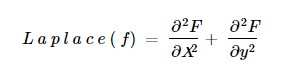
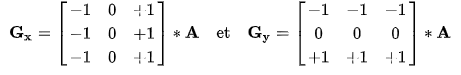

# Edge-detection
# OpenCV program Edge detection in real time 

The objective of the program given is to perform edge detection of images in real-time. 

I use for this project the 3 detection techniques :
Prewitt ;
laplacien ;
Canny ;

# The Laplacian filter

The Laplacian operator is defined by:
 .

Laplacian is a derivative mask of the second order. In this mask, we have two other classifications, the positive Laplacian operator and the negative Laplacian operator.
Inner edges
Outside edges

# The Prewitt filter

the filter is composed of two 3 × 3 matrices that we will convolute with the original image to calculate an approximation of its derivative at any point.
The first matrix gives the horizontal derivative and the second gives the vertical derivative.

# The canny filter:

The Canny edge detection algorithm consists of 5 steps:
Noise reduction;
Gradient calculation;
Non-maximum deletion;
Double threshold;
Edge tracking by hysteresis.
